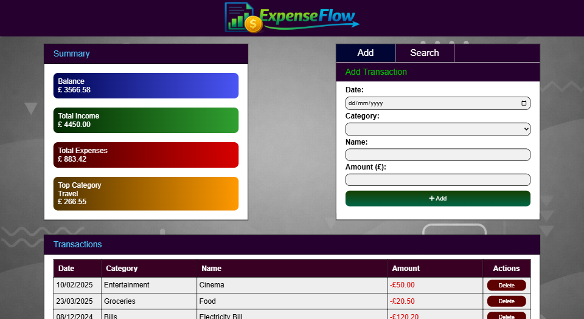
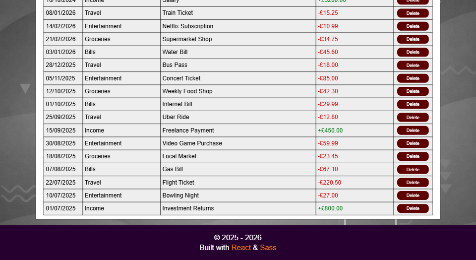
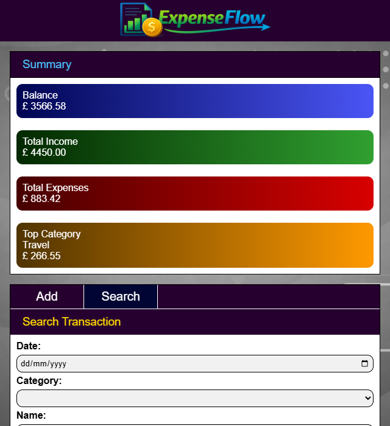
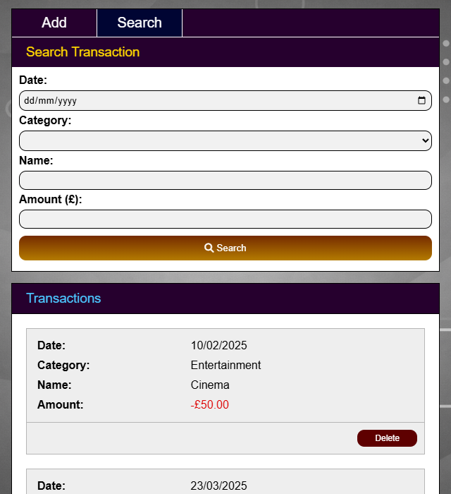
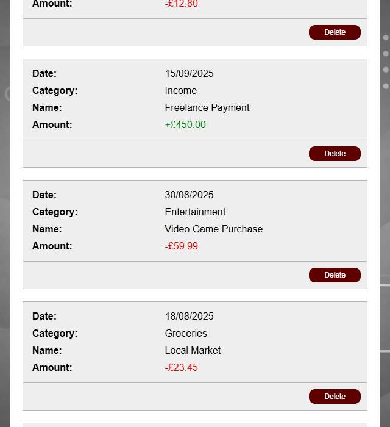
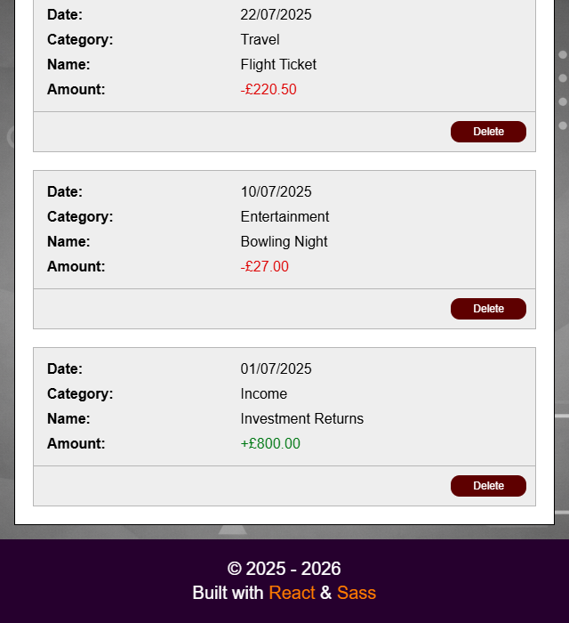

 <!-- comment -->

ExpenseFlow is a frontend expense tracker app, built with [React](https://react.dev/ "React"), [Sass](https://sass-lang.com/ "Sass") and [Vite](https://vite.dev/ "Vite"). Designed to help users manage income and expenses in a clear and responsive interface. ExpenseFlow provides a structured way to view transactions, monitor balances and interact with forms for accounting and bookkeeping new payments.

## Setup Instructions
Make sure you have **Node.js** already installed for dependency management.

#### 1. Clone the Repository:
Select your desired file directory, then enter the following commands in terminal:

```
git clone https://github.com/vkumar-2/React-ExpenseFlow.git
npm install
npm run dev
```
Note: `npm install` will install dependencies and only needs to be performed for first time installation.

#### 2. Access localhost URL:
After running `npm run dev`, Vite will output your local development URL in the terminal (e.g. http://localhost:5173 ). Enter the provided localhost link into your web browsers address bar.

## Frameworks

- **React** - powers the frontend of this expense tracker, allowing the interface to split into reusable components and make it easier to manage state and user interactions.
- **Sass** - enhanced CSS to enable cleaner styling structure through the use of nesting, mixins and reusable style logic.
- **Vite** - modern build tool to provide fast development environment with quick startup and hot module replacement.

## Images
| Desktop 1 |
| ------------ |
|  |

| Desktop 2 |
| ------------ |
|  |

| Tablet 1 | Tablet 2 |
| ------------ | ------------ |
|  |  |

| Tablet 3 | Tablet 4 |
| ------------ | ------------ |
|  |  |
